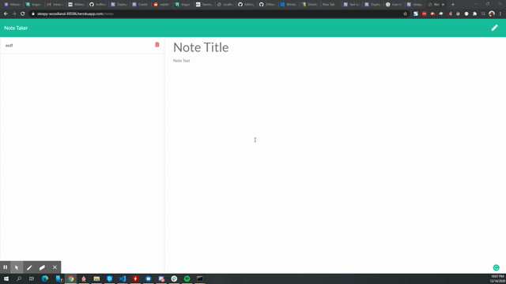

<h1 align="center">Note Taking App Using Node.js and express.js</h1>
  
<p align="center">
    
    
    
    
</p>
  
<p align="center">
    
    
    
    
    
    
</p>
   
## Description

🔍 A node.js express.js application that uses user input to create, store and delete notes.

[Heroku Live Link](https://sleepy-woodland-88586.herokuapp.com/)

💻 Below is the demo of the application:



## User Story

```
AS A business owner
I WANT to write and save notes
SO THAT I keep track of tasks and take notes
```

## Acceptance Criteria

```
GIVEN a note-taking application
WHEN I open the Note Taker
THEN I am presented with a landing page with a button to notes pages
WHEN I click on the button start note
THEN I am presented with a page of existing notes on the left column, plus empty fields to enter on the right
WHEN I enter a new note title and the note text
THEN a Save icon appears in the nav at the top of the page
WHEN I click on the Save icon
THEN note is saved and displayed on the left column
WHEN I click on the note from the left column
THEN the note will appear on the right
WHEN I click on the write icon
THEN I am presented with empty field to enter new note title and note text
```

## Table of Contents

- [Description](#description)
- [User Story](#user-story)
- [Acceptance Criteria](#acceptance-criteria)
- [Table of Contents](#table-of-contents)
- [Installation](#installation)
- [Usage](#usage)
- [Contributing](#contributing)
- [Questions](#questions)

## Installation

💾

`npm init`

`npm install express`

## Usage

💻

`node server.js`

## Contributing

👨 [Zi Wang](https://github.com/ZiWang55)

## Questions

✉️ Contact me with any questions: [email](mailto:ziwang55@gmail.com) , [GitHub](https://github.com/ZiWang55)<br />
